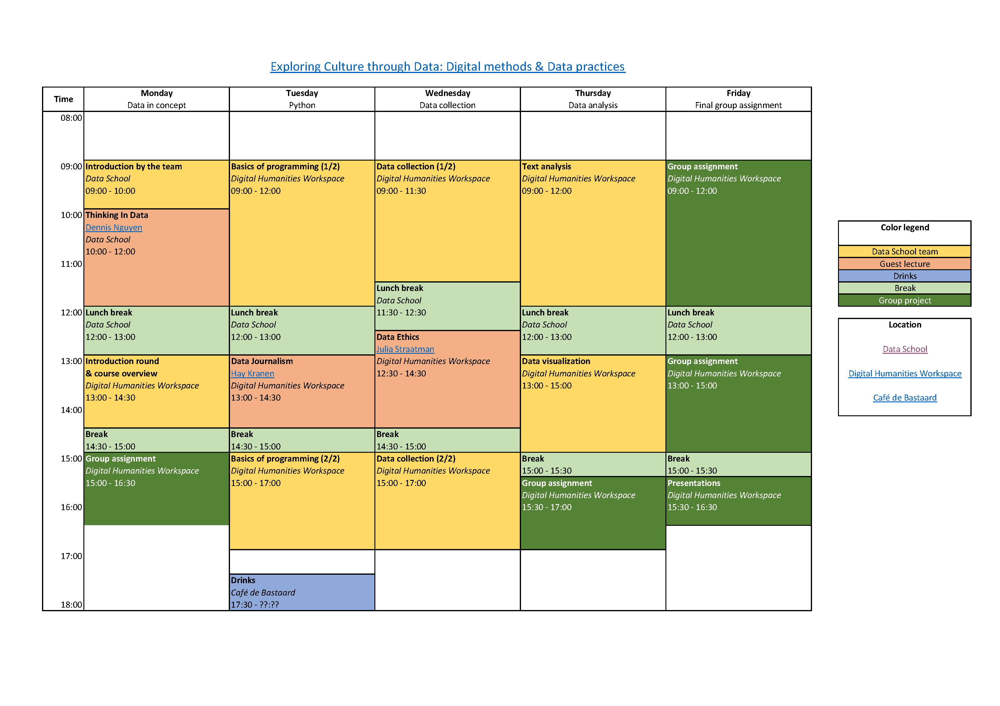

# Exploring Culture Through Data (Data School Summer School)
Welcome to the [Exploring Culture Through Data: Digital Methods & Data Practices](https://utrechtsummerschool.nl/courses/humanities/exploring-culture-through-data-digital-methods-data-practices) Summer School! We are excited to offer an in-depth exploration of using digital methods and data practices to analyze and understand culture. Join us to learn how to leverage data to gain insights into various cultural phenomena. Whether you are new to programming or an experienced data analyst, we have something for everyone.

For an overview of the summer school of 2024, see the [week schedule](docs/schedule.pdf):

[](docs/schedule.pdf)

## Contents
The content of this repository consists of three parts:
1. **[Code](https://github.com/CentreForDigitalHumanities/Exploring-Culture-Through-Data/tree/main/code)**, consisting of Jupyter Notebooks. 
3. **[Data](https://github.com/CentreForDigitalHumanities/Exploring-Culture-Through-Data/tree/main/data/)** that will be used during various assignments.
4. **[Documentation](https://github.com/CentreForDigitalHumanities/Exploring-Culture-Through-Data/tree/main/docs/)** about the course materials and presentations.

With that, the total structure looks roughly as follows:
```plaintext
code/
├── 01_preparation/
├── 02_basics_of_programming/
├── 03_text_analysis/
├── 04_data_visualization/
data/
├── GDP_by_country.xlsx
├── songs.csv
docs/
├── assignment.ipynb
├── documentation.ipynb
├── instructions.ipynb
├── questions.ipynb
├── syllabus.ipynb
├── slides/
│   ├── presentation.pdf
└── img/
    ├── logo.png
    └── diagram.png
README.md
```

## License & credits
This work is licensed under the [MIT License](LICENSE). This summer school was created by [Data School](https://dataschool.nl/) at [Utrecht University](https://www.uu.nl). 

Inspiration was drawn from the [Educational materials](https://github.com/CentreForDigitalHumanities/Education) by the [Centre for Digital Humanities](https://github.com/CentreForDigitalHumanities/).

<a href="https://dataschool.nl" target="_blank"></a>
